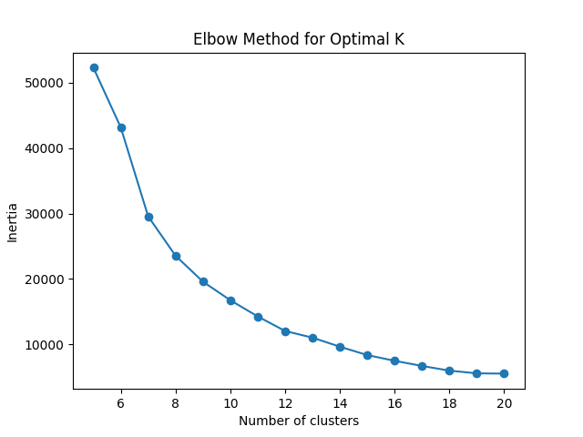

# Trend Sentiment Analysis

This project analyzes trends based on sentiment and extracts meaningful
insights from social media posts.

## Setup

1. Clone the repository
2. Create a virtual environment:
   ```bash
   python -m venv venv
   source venv/bin/activate  # On Windows: venv\Scripts\activate
   ```
3. Install dependencies:
   ```bash
   pip install -r requirements.txt
   ```

## How to Run

### Data Analysis and Visualization

```bash
python src/main.py
```

This will run the main analysis pipeline and generate visualizations.

### Individual Components

1. **Data Visualization**

   ```bash
   python src/data_vizualization.py
   ```

   Generates all plots and charts in the results folder.

2. **Trend Recommendation**

   ```bash
   python src/trend_recommender.py
   ```

   Runs the trend recommendation system.

3. **Sentiment Analysis**

   ```bash
   python src/sentiment_analysis.py
   ```

   Performs sentiment analysis on the data.

4. **Data Labeling**

   ```bash
   python src/label_data.py
   ```

   Processes and labels the raw data.

5. **Model Training**
   - Open `src/finetune_roberta.ipynb` in Google Colab
   - Upload the notebook to your Google Drive
   - Run all cells to train the model

## Results

The analysis generates several visualizations in the `results` folder:


_Distribution of trends over time_


_Analysis of trend duration patterns_


_Trend impressions analysis_


_Engagement patterns across trends_


_K-means clustering of trends_


_Visualization of trend clusters_


_Visualization of perplexity tuning_

### Sentiment Analysis

The project uses two main models for sentiment analysis:

- RoBERTa-based analysis
